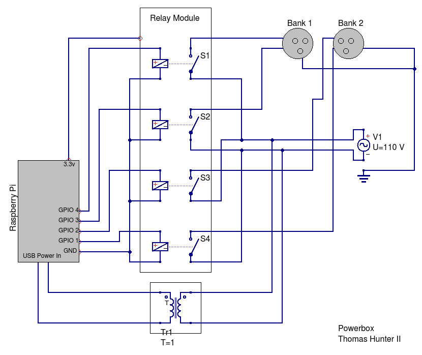
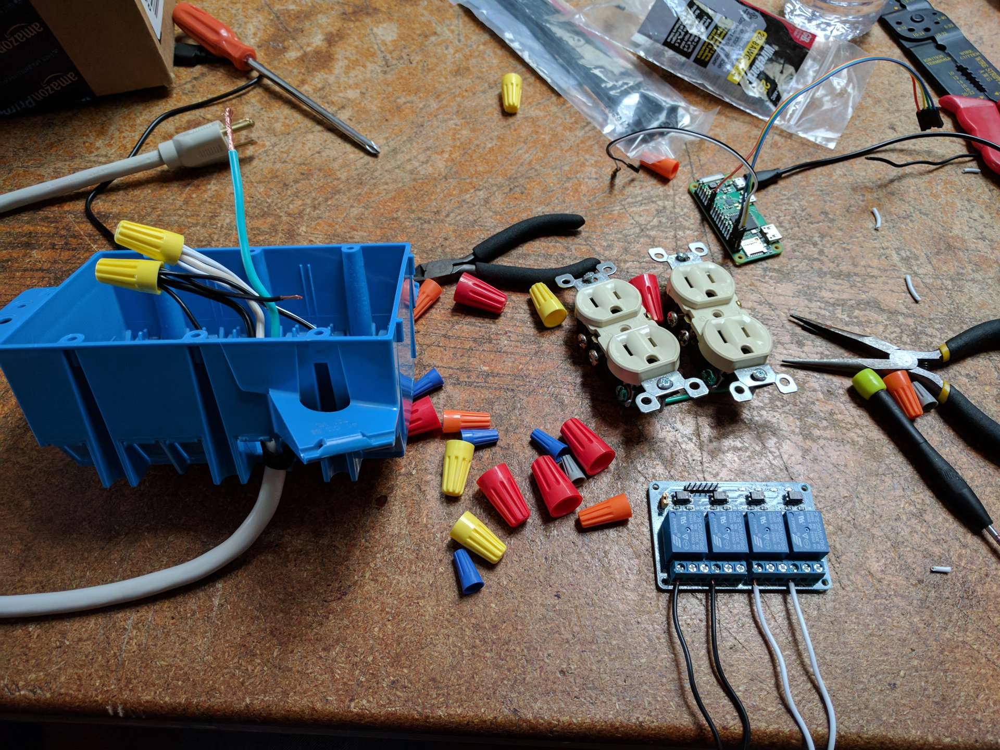
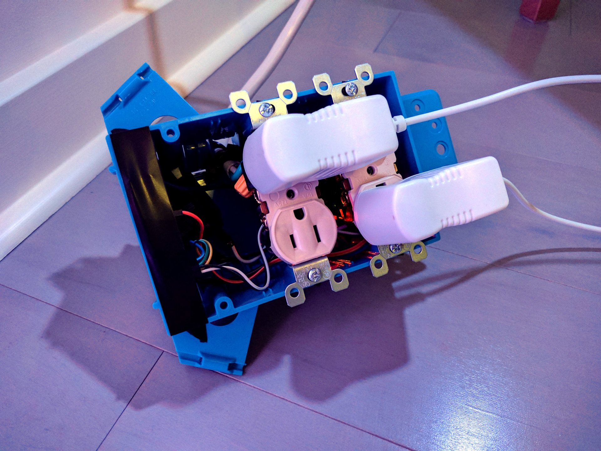

# Powerbox

The Powerbox is a physical device which plugs into a wall outlet and exposes two independent outlets of its own. It contains a small computer and can be configured to schedule times for enabling and disabling power.

This repository represents a service which runs on the device. This service can be accessed on the local network to configure the device. Configuration consists of setting a timezone, as well as scheduling the power outlets. This is similar to configuring a home router, for example.

The software will enable and disable GPIO ports which will in turn enable and disable relays controlling separate power banks.

This hardware and software was designed by me though it has been independently created by hundreds of other people.

## Installing and Running Service

You'll first need to configure your Raspberry Pi to boot an OS, connect to your network, and listen for SSH connections. A quick google search should tell you all you need.

```bash
ssh my-pi-hostname # SSH into your Raspberry Pi
sudo apt-get install sqlite3
git clone git@github.com:tlhunter/powerbox.git
cd powerbox
npm install
npm install -g forever
sudo PORT=80 forever start powerbox.js
```

Then you can visit http://my-pi-hostname and configure the schedule.

## Schematic

Here's a crude drawing of the schematic for this project. Basically the wires on the right are all thick AC wiring. The ones on the left are thin DC wiring.



## Assembley Instructions

TODO

## Parts

### Specialty Parts

You'll need to buy these from the internet or a specialty electronics/hobby shop.

* [Raspberry Pi Zero W](https://www.adafruit.com/product/3400?gclid=CPXflp-zk9QCFYGUfgod3toCsQ)
* [4 Channel DC 5V Relay](http://amzn.to/2qwNolk)
* 6 x [Double Female Jumpers](http://amzn.to/2qsEAxx)
* [Header Pins](http://amzn.to/2rcUtLR)

### Hardware Store Parts

These you can buy pretty cheaply from a local hardware store.

* [6" USB Micro B Cable](http://amzn.to/2qvXbZB) - Shorter is better
* [Small AC to USB Adapter](http://amzn.to/2qvT9AB) - Smaller and more amps is better
* Tools: Wirecutter, Large and Medium Flathead, Solder gun
* [Assorted Wirenuts](http://amzn.to/2rd8FEs) - For connecting thick AC wire
* 2 x Wall Outlets
* Power cord (I cannibalized a cheap powerstrip)
* Low Voltage and High Voltage wire
* [3 Gang Electrical Box](http://www.homedepot.com/p/3-Gang-44-cu-in-New-Work-Box-B344AB/100404028)
* Electrical tape
* [Zip Ties](http://amzn.to/2rdab9B)

## TODO

* Write instructions to start Powerbox as a systemd service
  * Otherwise you need to manually SSH and start service with each boot
* Incorporate a [Realtime Clock module](http://amzn.to/2s4GB4g)
  * Otherwise, if the device reboots and there's no power, clock will be wrong

## Media

[Video](https://vimeo.com/216466897)




