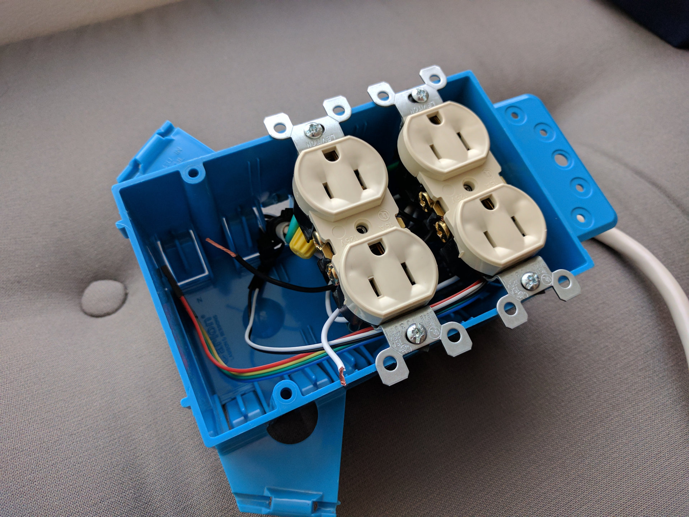

# Powerbox

The Powerbox is a physical device which plugs into a wall outlet and exposes two independent outlets of its own. It contains a small computer and can be configured to schedule times for enabling and disabling power.

This repository represents a service which runs on the device. This service can be accessed on the local network to configure the device. Configuration consists of setting a timezone, as well as scheduling the power outlets. This is similar to configuring a home router, for example.

The software will enable and disable GPIO ports which will in turn enable and disable relays controlling separate power banks.

This hardware and software was designed by me though it has been independently created by hundreds of other people.

## Parts

### Specialty Parts

You'll need to buy these from the internet or a specialty electronics/hobby shop.

* [Raspberry Pi Zero W](https://www.adafruit.com/product/3400?gclid=CPXflp-zk9QCFYGUfgod3toCsQ)
* [4 Channel DC 5V Relay](http://amzn.to/2qwNolk)
* 6 x [Double Female Jumpers](http://amzn.to/2qsEAxx)

### Hardware Store Parts

These you can buy pretty cheaply from a local hardware store.

* [Assorted Wirenuts](http://amzn.to/2rd8FEs)
* 2 x Wall Outlets
* Power cord (I cannibalized a cheap powerstrip)
* Low Voltage and High Voltage wire
* [3 Gang Electrical Box](http://www.homedepot.com/p/3-Gang-44-cu-in-New-Work-Box-B344AB/100404028)
* Electrical tape
* Tools: Wirecutter, Large and Medium Flathead
* [Zip Ties](http://amzn.to/2rdab9B)

## TODO

* Incorporate a [Realtime Clock module](http://amzn.to/2s4GB4g)
  * Otherwise, if the device reboots and there's no power, clock will be wrong

## Media

[Video](https://vimeo.com/216466897)

